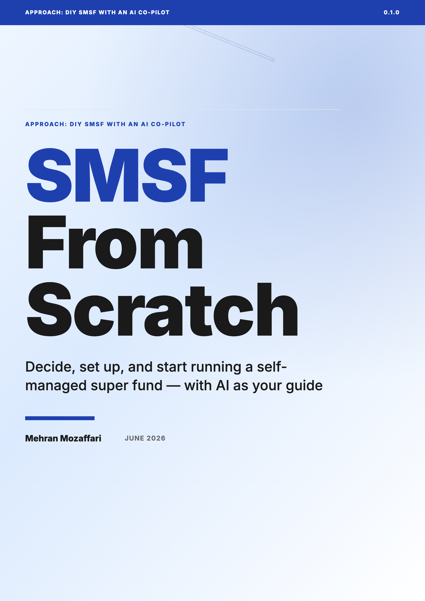

# SMSF From Scratch

> Decide, set up, and start running a self-managed super fund — with AI as your guide · by Mehran Mozaffari

Covers: deciding whether an SMSF suits you, how super and the SMSF structure work, using an AI co-pilot safely, trustees and structures, the establishment sequence, the investment strategy, contributions and caps, what a fund can and cannot invest in, record-keeping and minutes, estate-planning basics and death-benefit nominations, the annual audit and lodgement obligations, costs and providers, knowing when to bring in a professional, and a first-year roadmap with a reusable prompt pack. Does NOT give personal financial, tax, or legal advice, and does not cover advanced strategy (detailed LRBA structuring, NALI engineering, complex pension/estate design) beyond a 'know when to get help' level.

## Download

| Format | File |
|--------|------|
| Paged HTML Preview | [smsf-from-scratch-paged.html](smsf-from-scratch-paged.html) |
| ePub | [smsf-from-scratch.epub](smsf-from-scratch.epub) |
| HTML | [smsf-from-scratch.html](smsf-from-scratch.html) |
| PDF | [smsf-from-scratch.pdf](smsf-from-scratch.pdf) |

## What This Book Covers

Covers: deciding whether an SMSF suits you, how super and the SMSF structure work, using an AI co-pilot safely, trustees and structures, the establishment sequence, the investment strategy, contributions and caps, what a fund can and cannot invest in, record-keeping and minutes, estate-planning basics and death-benefit nominations, the annual audit and lodgement obligations, costs and providers, knowing when to bring in a professional, and a first-year roadmap with a reusable prompt pack. Does NOT give personal financial, tax, or legal advice, and does not cover advanced strategy (detailed LRBA structuring, NALI engineering, complex pension/estate design) beyond a 'know when to get help' level.

14 chapters are included in this release.

## Who Is This For

Complete beginners who are comfortable using AI tools and are considering, or have just started, a self-managed super fund. No finance, tax, or coding background assumed.

## Repository Contents

| Path | Purpose |
|------|---------|
| `README.md` | Public landing page for the book repository |
| `CHANGELOG.md` | Version-by-version release notes |
| `LICENSE.md` | Book license |
| `cover.png` | Public cover image generated from the same HTML cover used by the book artifacts |
| `<slug>.pdf` / `<slug>.epub` / `<slug>.html` / `<slug>-paged.html` | Final published book artifacts |

## About the Author

Mehran Mozaffari

## Credits

| Role | Credit |
|------|--------|
| Author | Mehran Mozaffari |
| Editorial review | Multi-model AI review pipeline |
| Technical reviewers | Claude Opus 4.6, Gemini 3.1 Pro |
| Design and production | Agentic publishing pipeline (OpenCode) |

## Contact the Author

- Blog: [https://piazr.github.io/applied-ai/](https://piazr.github.io/applied-ai/)
- GitHub: [https://github.com/imehr](https://github.com/imehr)

For corrections, errata, or licensing inquiries, please open an issue on this repository or contact the author through the channels above.

## Version

- **v0.1.0** — 2026-06-22
- AI tools evolve rapidly; check the official project documentation for current product behavior.

## License

[CC BY-NC-SA 4.0](https://creativecommons.org/licenses/by-nc-sa/4.0/) — free to share and adapt with attribution, non-commercial use only, under the same license.
